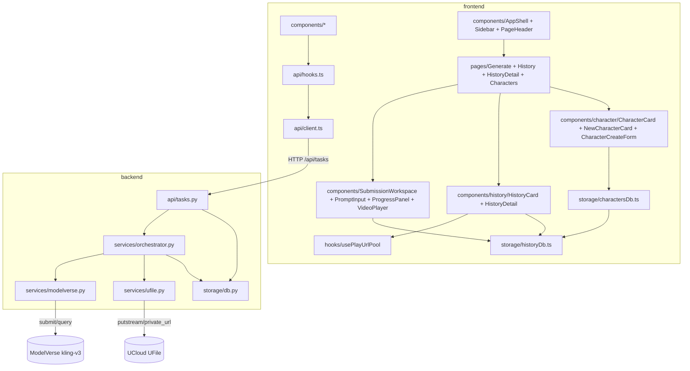

# 项目档案

> 网页版 AI 视频生成 MVP —— 单个个人创作者本机自用的浏览器应用：输入 prompt（可选首帧图）调用 UCloud ModelVerse 生成视频，成功结果转存 UFile 并在本浏览器内做历史菜单；同浏览器内沉淀可复用的 Character 角色资料库（参考图 + Name + Instructions）。

## 技术栈

| 层 | 选型 | 版本/备注 |
|---|---|---|
| 后端语言 | Python | 3.11+ |
| 后端框架 | FastAPI | 异步原生 + Pydantic 校验 |
| 后端 HTTP 客户端 | httpx (async) | 调 ModelVerse |
| 后端持久化 | SQLite | 标准库 sqlite3，单文件 `backend/tasks.db` |
| 后端任务调度 | FastAPI BackgroundTasks + asyncio | 单进程单任务串行 |
| 对象存储 SDK | UCloud 官方 `ufile` Python SDK | `putstream` + `private_download_url` |
| 视频模型 | UCloud 星图 ModelVerse `kling-v3` | base URL `https://api.modelverse.cn`，文生/图生靠 `parameters.image` 自动切换 |
| 包构建 | setuptools (pyproject.toml) | `pip install -e "backend[dev]"` |
| 前端框架 | React + TypeScript | React 18.3 |
| 前端构建 | Vite | 5.x |
| 前端路由 | react-router-dom | v6（一级路由 + 路径参数） |
| 前端 HTTP | 原生 `fetch` | 不引第三方 |
| 前端持久化 | IndexedDB（`idb` v8 + DBSchema） | 多 store：`history` 索引（仅元数据）+ `characters` 资料（含参考图 Blob） |
| 样式方案 | CSS Modules + `:root` design tokens | 字体 IBM Plex Sans，accent 冷蓝 `#1d4ed8` |
| 后端测试 | pytest + pytest-asyncio | 运行命令 `pytest`（`backend/tests/`） |
| 前端测试 | 暂无测试基础设施 | 后续 cycle 如需测试再单独决策落 PROJECT.md |

## 模块地图

| 模块 | 职责 | 文档 |
|---|---|---|
| `backend/` | FastAPI 应用根，启动入口与配置 | [backend/README.md](backend/README.md) |
| `backend/app/api/` | HTTP 路由层（`/api/tasks` 6 个端点） | — |
| `backend/app/services/` | ModelVerse 客户端 / UFile 封装 / 任务编排器 | [backend/app/services/README.md](backend/app/services/README.md) |
| `backend/app/storage/` | SQLite 初始化与 tasks 表 CRUD | [backend/app/storage/README.md](backend/app/storage/README.md) |
| `frontend/` | React SPA 根，Vite 配置 | [frontend/README.md](frontend/README.md) |
| `frontend/src/api/` | 后端 API 客户端 + 5 秒轮询 hook | [frontend/src/api/README.md](frontend/src/api/README.md) |
| `frontend/src/storage/` | IndexedDB 入口（`historyDb.ts` 持有 DB schema + upgrade 流；`charactersDb.ts` 暴露角色 CRUD + `useCharacters` hook） | [frontend/src/storage/README.md](frontend/src/storage/README.md) |
| `frontend/src/components/` | UI 组件层（SubmissionWorkspace / PromptInput / ProgressPanel / VideoPlayer + AppShell / character / history 子目录） | [frontend/src/components/README.md](frontend/src/components/README.md) |
| `frontend/src/components/AppShell/` | 应用外壳：两列 grid（Sidebar + 主区）、Generate/History/Characters 三 page keep-mounted、`<Routes>` 派发 | [frontend/src/components/AppShell/README.md](frontend/src/components/AppShell/README.md) |
| `frontend/src/components/character/` | Characters 页 grid 卡片三件套（CharacterCard / NewCharacterCard / CharacterCreateForm） | [frontend/src/components/character/README.md](frontend/src/components/character/README.md) |
| `frontend/src/components/history/` | History 模块展示组件（HistoryCard / HistoryDetail） | [frontend/src/components/history/README.md](frontend/src/components/history/README.md) |
| `frontend/src/pages/` | 一级路由页面（GeneratePage / HistoryPage / HistoryDetailPage / CharactersPage） | [frontend/src/pages/README.md](frontend/src/pages/README.md) |
| `frontend/src/hooks/` | 跨页面共享自定义 hook（`usePlayUrlPool`：并发上限 + TTL 缓存） | [frontend/src/hooks/README.md](frontend/src/hooks/README.md) |
| `scripts/` | 联调启动脚本 `dev.sh`（同时拉起前后端） | — |

## 代码约定

- **前后端跨边界字段统一 snake_case**：API client 不在前端把 `created_at` / `play_url` 改写为 camelCase，所有跨边界字段保留后端形态。
- **纯前端实体用 camelCase**：不跨后端边界的前端本地实体（如 IDB `characters` store 的 `createdAt` / `nameKey`）使用 camelCase；这条与上一条配套，按"是否跨边界"区分。
- **失败任务后端留行、前端不入历史**：SQLite `tasks` 表保留 `status=failure` 行用于排查；`GET /api/tasks` 与 IndexedDB 都只看 `success`。
- **视频本体只在 UFile**：前端 IndexedDB 仅存 `id / prompt / hasImage / title / createdAt / finishedAt` 索引；播放与下载每次新调 `GET /api/tasks/{id}/play_url` 取 1 小时预签名 URL，不缓存视频字节。
- **前端 IDB 多 store 单一入口**：`DB_NAME` / `DB_VERSION` / `upgrade` 真相源只在 `frontend/src/storage/historyDb.ts`；新增 store 模块通过 `import { getDb } from './historyDb'` 复用入口，禁止复刻 upgrade 回调。新增 store 时 `DB_VERSION` 在原值上 `+1`，`onUpgradeNeeded` 用 `oldVersion < N` 分级，只在更高版本分支创建新 store，不重建已有 store。
- **IDB Schema 类型集中**：`AppDbSchema`（含所有 store 的字段、索引类型）与各 store 的 record 类型统一从 `historyDb.ts` 导出，避免多文件双写类型漂移。
- **单任务串行用进程内 in-flight 锁**：第二个并发 POST 直接 409 `task_in_progress`；这是有意的简化，不支持多进程部署。
- **设计 token 走 CSS Modules + `:root` 变量**：组件不写裸色值/裸字号，统一引用 token；详见前端 components README。
- **请求体上限统一 16 MiB**：FastAPI 中间件层放开，覆盖 10 MB 图片 base64 后膨胀。
- **顶层导航走 react-router-dom 一级路由 + sidebar keep-mounted**：Generate / History / Characters 三 page 在 AppShell 中常驻挂载，由 `display:none + aria-hidden + tabIndex=-1 + pointer-events:none` 控制可见性；`/history/:id` 详情页正常 mount/unmount；进度可见性仅在 GeneratePage 内 ProgressPanel 出现，不在 sidebar / PageHeader / 其他页面以全局形式重复。
- **History 卡首帧走 `<video preload="metadata">` 现取，不缓存字节**：通过 `usePlayUrlPool` 限流取 `play_url`（并发上限 6 + 1 小时 TTL），不引入 canvas 生成缩略图 Blob、不改 IDB schema。

## 关键决策

- **kling-v3 单 model id 覆盖文生 + 图生**：靠 `parameters.image` 是否传入自动切换路径，避免在用户侧暴露"模型选择"按钮，契合需求"不暴露任何生成参数"。
- **官方 `ufile` SDK 不选 boto3 + S3 兼容层**：项目已锁 UCloud 账号体系，可移植性优势不成立；`putstream` + `private_download_url` 比 boto3 三件套配置简洁。
- **视频强制转存 UFile，不直接复用 ModelVerse 临时 URL**：临时 URL 过期上限未明示，存 URL 会让历史几天后全部 404；转存到 UFile 是必须项。
- **后端持久化 SQLite 不用全内存**：MVP 也要避免开发期重启丢任务关联；单文件零运维，标准库自带。
- **前端轮询不用 SSE / WebSocket**：单用户场景下 5 秒一次 GET 完全够，SSE 引入的连接管理对 MVP 是负担。
- **FastAPI BackgroundTasks 不用 Celery**：MVP 单进程、单任务串行，BackgroundTasks 足够；重启丢 in-flight 任务被显式接受。
- **IndexedDB 索引 + 5 秒轻量 `getAll` 轮询**：刷新即可见，多窗口下也能跟上后端权威源；不为 MVP 引入 SSE。
- **`scripts/dev.sh` 用 `npm run dev` 不 `exec`**：`exec` 会替换 bash 进程使 trap 失效，无法在前端退出后自动清理后端 nohup 进程。
- **IDB 数据库名沿用 `video-mvp` 不改名**：项目名可演化，但 DB 名一旦改动会让浏览器把现有数据库视为孤儿、丢历史；改名等价于"清库重来"，无升级路径。
- **Character 参考图存 Blob 不存 base64**：IDB 原生支持 Blob，无 ~33% 序列化膨胀；渲染走 `URL.createObjectURL` 在组件本身 `useEffect` cleanup 中 `revokeObjectURL`，不在容器层维护 URL 引用表（避免双 revoke 与所有权混乱）。
- **唯一性约束 IDB 索引 + 应用层预查重双保险**：`characters.by_name_key` 索引 `unique: true` 作为兜底；`createCharacter` 先在 readwrite 事务内查重后写入，事务级别保证并发原子性。
- **顶层导航选 `react-router-dom` v6 不自建 history hook**：成熟度 + 嵌套路由 + `/history/:id` 参数提取零成本；"前端 HTTP 不引第三方"的节制针对 fetch 不针对路由；5 条 path + 详情页动态参数写自建 hook 节省不了多少。
- **三页 keep-mounted 不外提任务状态到 Context**：需求约束"内部组件逻辑不改动"；外提任务状态等于重写 SubmissionWorkspace，越界；`display:none` 切可见性能保住 GeneratePage 内的轮询 hook 与进度，跨页切换不打断当前任务。
- **创建表单走 `/characters/new` 同 page 内嵌 + 删除二次确认卡内自管**：贴合"不弹 modal、不跳页（指不跳出本 SPA）"的视觉契约；`/characters/new` 在 CharactersPage 自身内部 grid 下方渲染 formPanel；删除二次确认在 CharacterCard 本体内自管，父级不感知细节。
- **History 卡片首帧不存 IDB**：选 `<video preload="metadata">` + `currentTime=0.1` 取帧而非 canvas 转 Blob 存 IDB；后者要 `DB_VERSION+1` + upgrade + 改 history record 字段，越过"不动 DB schema"边界。

## 已知限制 / 坑

- **进程内 in-flight 锁不支持多进程**：若部署到多 worker，并发=1 的强约束会被打破。
- **后端重启会把 `running` 行直接标记为 `failure(interrupted_by_restart)`**：MVP 不做断点续轮询；用户感知为该次任务失败。
- **历史与 Character 库都绑定单一浏览器**：清缓存 / 换设备 / 换浏览器都会丢失 IndexedDB 数据；MVP 不做跨设备同步。
- **仅桌面端浏览器**：不做移动 / 平板适配，也不做暗色模式 / 多语言。
- **UFile 预签名 URL 1 小时硬编码**：若 US3 region 不允许 3600s，需要调短；UFile bucket 必须手动在控制台配 CORS（GET/HEAD + Range，暴露 `Content-Length` / `Content-Range` / `Accept-Ranges`），否则 `<video>` seek 会断。
- **任务硬超时 5 分钟**：超时即判 failure，不延长不重试；实际 P95 视模型负载浮动。
- **CORS 白名单仅 `http://localhost:5173`**：换端口或换源需要改 backend 配置。
- **Character 编辑能力缺失**：当前只交付增 / 查 / 删；改名 / 换图 / 改描述都不支持，要改只能删了重建。
- **Character 库未接入生成流程**：尚未在 prompt 生成里"选角色一起生成"；该接入留给后续 cycle。
- **History 卡首帧依赖 play_url 可用**：若 `play_url` 取失败 / 视频 metadata 加载失败，卡片背景退化为纯色占位；不预生成本地缩略图。
- **跨页无全局进度提示**：在 History / Characters 页看不到 Generate 页正在跑的任务进度，必须切回 Generate；这是有意取舍（sidebar 不挂 badge / 不挂全局状态栏）。

## 视觉契约

| 字段 | 取值 |
|---|---|
| 风格基调 | minimal-refined |
| 明暗主调 | 浅色 |
| 主导色色系 | 冷色系 |
| accent 用途 | 主 CTA / 焦点态 / 关键状态指示 |
| 字体倾向 | 无衬线 |
