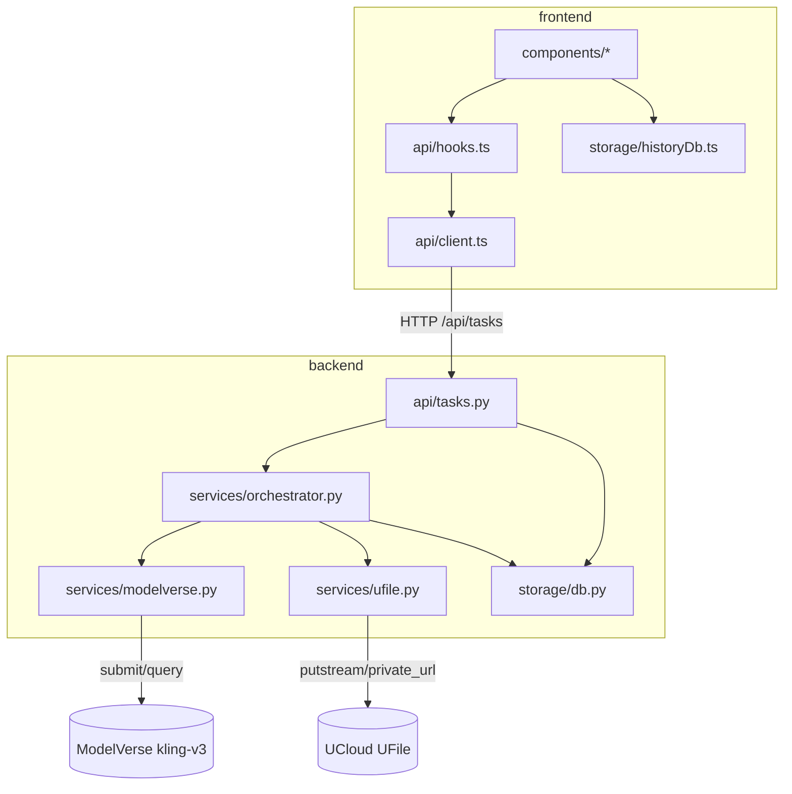

# 项目档案

> 网页版 AI 视频生成 MVP —— 单个个人创作者本机自用的浏览器应用：输入 prompt（可选首帧图）调用 UCloud ModelVerse 生成视频，成功结果转存 UFile 并在本浏览器内做历史菜单。

## 技术栈

| 层 | 选型 | 版本/备注 |
|---|---|---|
| 后端语言 | Python | 3.11+ |
| 后端框架 | FastAPI | 异步原生 + Pydantic 校验 |
| 后端 HTTP 客户端 | httpx (async) | 调 ModelVerse |
| 后端持久化 | SQLite | 标准库 sqlite3，单文件 `backend/tasks.db` |
| 后端任务调度 | FastAPI BackgroundTasks + asyncio | 单进程单任务串行 |
| 对象存储 SDK | UCloud 官方 `ufile` Python SDK | `putstream` + `private_download_url` |
| 视频模型 | UCloud 星图 ModelVerse `kling-v3` | base URL `https://api.modelverse.cn`，文生/图生靠 `parameters.image` 自动切换 |
| 包构建 | setuptools (pyproject.toml) | `pip install -e "backend[dev]"` |
| 前端框架 | React + TypeScript | React 18.3 |
| 前端构建 | Vite | 5.x |
| 前端 HTTP | 原生 `fetch` | 不引第三方 |
| 前端持久化 | IndexedDB（`idb` v8 + DBSchema） | 仅存历史索引，不存视频字节 |
| 样式方案 | CSS Modules + `:root` design tokens | 字体 IBM Plex Sans，accent 冷蓝 `#1d4ed8` |

## 模块地图

| 模块 | 职责 | 文档 |
|---|---|---|
| `backend/` | FastAPI 应用根，启动入口与配置 | [backend/README.md](backend/README.md) |
| `backend/app/api/` | HTTP 路由层（`/api/tasks` 6 个端点） | — |
| `backend/app/services/` | ModelVerse 客户端 / UFile 封装 / 任务编排器 | [backend/app/services/README.md](backend/app/services/README.md) |
| `backend/app/storage/` | SQLite 初始化与 tasks 表 CRUD | [backend/app/storage/README.md](backend/app/storage/README.md) |
| `frontend/` | React SPA 根，Vite 配置 | [frontend/README.md](frontend/README.md) |
| `frontend/src/api/` | 后端 API 客户端 + 5 秒轮询 hook | [frontend/src/api/README.md](frontend/src/api/README.md) |
| `frontend/src/storage/` | IndexedDB 历史索引读写 | [frontend/src/storage/README.md](frontend/src/storage/README.md) |
| `frontend/src/components/` | UI 组件（SubmissionWorkspace / PromptInput / ProgressPanel / VideoPlayer / HistoryDrawer / HistoryDetail） | [frontend/src/components/README.md](frontend/src/components/README.md) |
| `scripts/` | 联调启动脚本 `dev.sh`（同时拉起前后端） | — |

## 代码约定

- **前后端字段命名统一 snake_case**：API client 不在前端把 `created_at` / `play_url` 改写为 camelCase，所有跨边界字段保留后端形态。
- **失败任务后端留行、前端不入历史**：SQLite `tasks` 表保留 `status=failure` 行用于排查；`GET /api/tasks` 与 IndexedDB 都只看 `success`。
- **视频本体只在 UFile**：前端 IndexedDB 仅存 `id / prompt / hasImage / title / createdAt / finishedAt` 索引；播放与下载每次新调 `GET /api/tasks/{id}/play_url` 取 1 小时预签名 URL，不缓存视频字节。
- **单任务串行用进程内 in-flight 锁**：第二个并发 POST 直接 409 `task_in_progress`；这是有意的简化，不支持多进程部署。
- **设计 token 走 CSS Modules + `:root` 变量**：组件不写裸色值/裸字号，统一引用 token；详见前端 components README。
- **请求体上限统一 16 MiB**：FastAPI 中间件层放开，覆盖 10 MB 图片 base64 后膨胀。

## 关键决策

- **kling-v3 单 model id 覆盖文生 + 图生**：靠 `parameters.image` 是否传入自动切换路径，避免在用户侧暴露"模型选择"按钮，契合需求"不暴露任何生成参数"。
- **官方 `ufile` SDK 不选 boto3 + S3 兼容层**：项目已锁 UCloud 账号体系，可移植性优势不成立；`putstream` + `private_download_url` 比 boto3 三件套配置简洁。
- **视频强制转存 UFile，不直接复用 ModelVerse 临时 URL**：临时 URL 过期上限未明示，存 URL 会让历史几天后全部 404；转存到 UFile 是必须项。
- **后端持久化 SQLite 不用全内存**：MVP 也要避免开发期重启丢任务关联；单文件零运维，标准库自带。
- **前端轮询不用 SSE / WebSocket**：单用户场景下 5 秒一次 GET 完全够，SSE 引入的连接管理对 MVP 是负担。
- **FastAPI BackgroundTasks 不用 Celery**：MVP 单进程、单任务串行，BackgroundTasks 足够；重启丢 in-flight 任务被显式接受。
- **IndexedDB 索引 + 5 秒轻量 `getAll` 轮询**：刷新即可见，多窗口下也能跟上后端权威源；不为 MVP 引入 SSE。
- **`scripts/dev.sh` 用 `npm run dev` 不 `exec`**：`exec` 会替换 bash 进程使 trap 失效，无法在前端退出后自动清理后端 nohup 进程。

## 已知限制 / 坑

- **进程内 in-flight 锁不支持多进程**：若部署到多 worker，并发=1 的强约束会被打破。
- **后端重启会把 `running` 行直接标记为 `failure(interrupted_by_restart)`**：MVP 不做断点续轮询；用户感知为该次任务失败。
- **历史绑定单一浏览器**：清缓存 / 换设备 / 换浏览器都会丢失 IndexedDB 索引；MVP 不做跨设备同步。
- **仅桌面端浏览器**：不做移动 / 平板适配，也不做暗色模式 / 多语言。
- **UFile 预签名 URL 1 小时硬编码**：若 US3 region 不允许 3600s，需要调短；UFile bucket 必须手动在控制台配 CORS（GET/HEAD + Range，暴露 `Content-Length` / `Content-Range` / `Accept-Ranges`），否则 `<video>` seek 会断。
- **任务硬超时 5 分钟**：超时即判 failure，不延长不重试；实际 P95 视模型负载浮动。
- **CORS 白名单仅 `http://localhost:5173`**：换端口或换源需要改 backend 配置。

## 视觉契约

| 字段 | 取值 |
|---|---|
| 风格基调 | minimal-refined |
| 明暗主调 | 浅色 |
| 主导色色系 | 冷色系 |
| accent 用途 | 主 CTA / 焦点态 / 关键状态指示 |
| 字体倾向 | 无衬线 |
