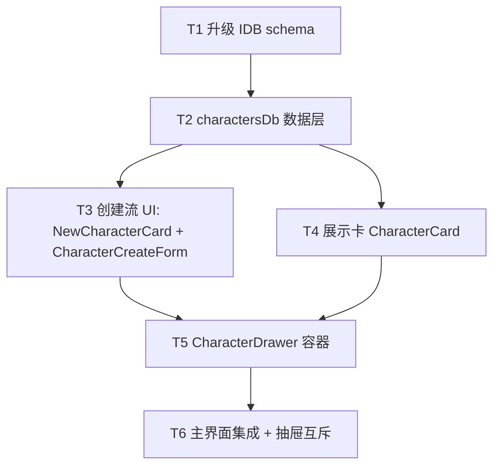

# 执行计划

## 概览
- 共 6 个 task
- 在现有 mays-vlog 前端工程内增量交付浏览器本地的 Character 库（增 / 查 / 删），通过独立侧折抽屉接入主界面；不动后端、不新增任何 `/api/*`，不改 `frontend/src/api/`

## 依赖图

## Tasks

### T1: 升级 IndexedDB schema，新增 characters store
- deps: []
- acceptance:
  - 读现有 `frontend/src/storage/historyDb.ts` 当前 DB version，本次在该值上 `+1`
  - 在 `onUpgradeNeeded` 中创建 object store `characters`，`keyPath: 'id'`
  - 在 `characters` 上建索引 `by_created_at`（field: `createdAt`）与 `by_name_key`（field: `nameKey`, `unique: true`）
  - 保留对现有 `history` store 的全部既有行为；升级流不丢历史数据
  - 浏览器 IDB 首次打开应用后，DevTools Application → IndexedDB 中可见 `mays-vlog` 数据库新增 `characters` store 与两个索引
  - DBSchema TypeScript 类型新增 `characters` 条目，类型字段与 DESIGN 一致（`id / name / nameKey / instructions / image: Blob / createdAt`）
  - 不引入新依赖
- context_hint: 参考 DESIGN.md 的「模块划分」「数据模型」两节

### T2: 实现 charactersDb 数据层 + useCharacters hook
- deps: [T1]
- acceptance:
  - 新建 `frontend/src/storage/charactersDb.ts`，导出 `listCharacters` / `createCharacter` / `deleteCharacter` 三个函数，签名与 DESIGN「接口设计」一致
  - `listCharacters()` 按 `createdAt` 倒序返回全部角色
  - `createCharacter({ name, instructions?, image })`：
    - name trim 后为空 → 抛 `EmptyNameError`
    - `nameKey = name.trim().toLowerCase()` 已存在 → 抛 `DuplicateNameError`
    - image MIME 不在 `image/png` / `image/jpeg` / `image/webp` 集合 → 抛 `InvalidImageError`
    - 校验通过 → 用 `crypto.randomUUID()` 生成 id、存入 IDB、返回完整 `Character`
  - `deleteCharacter(id)` 从 IDB 删除指定记录；id 不存在视为 no-op
  - 导出三类自定义错误类（或可判定的 error 标记），调用方可区分错误种类
  - 提供一个 React hook（独立文件或合入 `charactersDb.ts` 均可，**参照 `frontend/src/storage/historyDb.ts` 中 history 的现有惯例选择**）：暴露 `characters` 列表、`refresh`、`create`、`remove`，create / remove 成功后乐观刷新内存列表
  - 在该 hook 模块的 README 或同目录现有 README 中追加 character 数据层说明（如果 `frontend/src/storage/README.md` 已存在则更新）
  - 不写「为将来扩展先写的抽象」、不留 TODO 占位函数
- context_hint: 参考 DESIGN.md 的「接口设计」「Character 实体字段」「关键流程 - 创建角色」

### T3: 创建流 UI（NewCharacterCard 占位卡 + CharacterCreateForm 表单）
- deps: [T2]
- acceptance:
  - 新建 `frontend/src/components/CharacterDrawer/NewCharacterCard.tsx`：网格首格的「新建角色」占位卡，点击触发外部回调
  - 新建 `frontend/src/components/CharacterDrawer/CharacterCreateForm.tsx`：包含图片上传（`<input accept="image/png,image/jpeg,image/webp">`）、Name 必填、Instructions 可选、提交、取消
  - 选中图片后表单内 `` 预览选中的图，submit 前再做一次 MIME 二次校验
  - 提交时：
    - name trim 空 → 表单内显示对应错误文案，不调用数据层
    - 数据层抛 `DuplicateNameError` → 表单内显示「Name 已存在」类文案
    - 数据层抛 `InvalidImageError` → 表单内显示图片格式错误文案
    - 成功 → 调用外部 `onCreated(character)` 回调，由父组件负责切回列表态
  - 取消 / 提交成功后表单内部状态被清空，本组件不负责切换抽屉态
  - 表单底部放轻量提示「过大图片会拖慢加载」（不做硬限）
  - 样式走 CSS Modules + 项目 `:root` design tokens（accent `#1d4ed8`），字体 IBM Plex Sans，符合 PROJECT.md「视觉契约」
  - 维护 `frontend/src/components/CharacterDrawer/README.md`（本 task 首次新建文件夹时建立，简述抽屉子组件职责矩阵）
- context_hint: 参考 DESIGN.md 的「模块划分」「关键流程 - 创建角色」「非功能性约束 - 图片格式」

### T4: 展示卡 CharacterCard（含内联展开 + 删除二次确认）
- deps: [T2]
- acceptance:
  - 新建 `frontend/src/components/CharacterDrawer/CharacterCard.tsx`
  - 默认态：显示参考图 + Name
  - 点击卡片头部 → 原地内联展开，下方显示完整 Instructions（无 Instructions 时显示占位空提示）和「删除」按钮
  - 再次点击卡片头部 → 折叠回默认态
  - 多卡可并存展开（每张卡独立状态）
  - 删除流程二次确认走「卡内内联变态」：
    1. 展开态点击「删除」→ 同位置变态为「确认删除 | 取消」两个并排按钮
    2. 点「确认删除」→ 调用外部 `onDelete(id)` 回调；本组件不直接动 IDB
    3. 点「取消」→ 回到普通展开态，按钮恢复为「删除」
  - 卡片为图片使用 `URL.createObjectURL(blob)` 渲染；组件 unmount 时 `URL.revokeObjectURL` 释放该 URL
  - 样式走 CSS Modules + 项目 `:root` design tokens；符合 PROJECT.md 视觉契约
  - 不弹任何 modal、不跳页
  - 更新 `frontend/src/components/CharacterDrawer/README.md` 加入本组件条目
- context_hint: 参考 DESIGN.md 的「模块划分」「关键流程 - 查看角色」「关键流程 - 删除角色」「非功能性约束 - 图片渲染」

### T5: CharacterDrawer 容器（列表态 / 创建表单态 + 抽屉外壳）
- deps: [T3, T4]
- acceptance:
  - 新建 `frontend/src/components/CharacterDrawer/CharacterDrawer.tsx`
  - 接受外部 props 控制开关状态（与 HistoryDrawer 现有抽屉协议对齐，由 T6 真正接入）；本 task 内允许在 storybook-less 项目里用一个临时挂载位验证功能
  - 抽屉进出动效沿用 `HistoryDrawer` 同款（曲线、时长、方向、宽度风格一致）
  - 内部维护 `view: 'list' | 'create'` 两态：
    - 默认 `'list'`
    - 点 NewCharacterCard → 切到 `'create'`，顶部变为「← 返回 | 新建角色」
    - 创建成功 / 表单取消 / 返回 → 切回 `'list'`
  - `'list'` 态首次进入（或抽屉首次打开）调用数据层 `listCharacters()` 拉数据；首格固定渲染 NewCharacterCard，后续按 `createdAt` 倒序渲染 CharacterCard 列表
  - 抽屉关闭后再次打开重置为 `'list'` 态（不保留先前展开态 / 表单态）
  - 删除卡片：调用数据层 `deleteCharacter(id)`、从列表移除、`URL.revokeObjectURL` 该卡用过的 object URL
  - 组件 unmount 时统一 revoke 本抽屉生成的所有 object URL
  - 错误处理：列表加载失败 / 删除失败 → `console.error` + 简单的内联错误提示，不上报
  - 样式走 CSS Modules + 项目 `:root` design tokens
  - 更新 `frontend/src/components/CharacterDrawer/README.md` 把整个抽屉子模块的职责矩阵写完整
- context_hint: 参考 DESIGN.md 的「模块划分」「关键流程 - 打开抽屉」「关键流程 - 关闭抽屉 / 切到另一抽屉」「非功能性约束」

### T6: 主界面集成 header 入口 + 抽屉互斥
- deps: [T5]
- acceptance:
  - 找到当前挂 HistoryDrawer 入口的父组件（DESIGN 建议是 `SubmissionWorkspace.tsx`，task-executor 自行读代码确认），把它的抽屉开关状态从两个独立 boolean 改为单值 `openDrawer: 'none' | 'history' | 'characters'`
  - 在 header 右上原 History 入口按钮**旁边**新增 Characters 入口按钮（图标/标签由 executor 自决，符合视觉契约）
  - 点击 History 按钮 → `openDrawer = 'history'`；若先前是 `'characters'` 同帧关闭 Character 抽屉
  - 点击 Characters 按钮 → `openDrawer = 'characters'`；若先前是 `'history'` 同帧关闭 History 抽屉
  - 抽屉自身的关闭按钮 → `openDrawer = 'none'`
  - HistoryDrawer 现有功能（列表、播放、下载、重命名、删除）完全不回归
  - 现有 prompt 生成流（PromptInput / ProgressPanel / VideoPlayer / 后端 `/api/*`）的 UI 与行为完全不变
  - 端到端冒烟：
    - 启动 `scripts/dev.sh` 或单独 `npm run dev` 能正常构建并访问 `http://localhost:5173`
    - 打开 Characters 抽屉 → 新建一个角色 → 列表出现 → 关闭抽屉 → 刷新页面 → 再次打开抽屉 → 角色仍在
    - 切换 History 抽屉与 Character 抽屉，二者互斥不并存
    - 现有视频生成提交流可正常跑通（执行人 best-effort 验证，依赖外部 API 即可只验证 UI 可用性）
  - 更新 `frontend/src/components/README.md` 反映新增的 CharacterDrawer 模块入口和抽屉互斥模型
- context_hint: 参考 DESIGN.md 的「模块划分 - 顶部入口 & 抽屉协调」「关键流程 - 打开抽屉」「决策清单 - 入口按钮放 header 右上与 History 并排」
