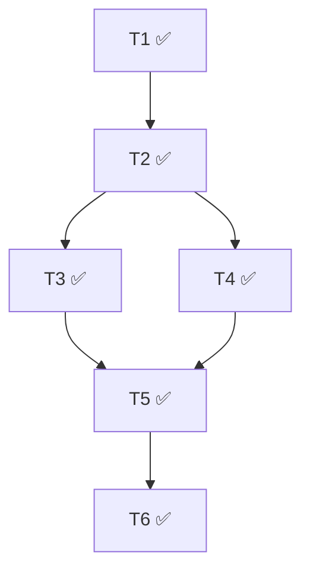

# 执行状态

## 概览
- 总数：6
- ✅ 完成：6
- ❌ 阻塞：0
- 🔄 进行中：0
- ⏳ 待启动：0
- 最后更新：2026-05-13T08:40:00+08:00

## 依赖图

## Tasks

### T1: 升级 IndexedDB schema，新增 characters store ✅
- commit: d77c7f3
- 改动文件：frontend/src/storage/historyDb.ts, frontend/src/storage/README.md
- 关键决策：DB 名沿用 video-mvp（不改名以保历史）；DB v1→v2 增量升级；AppDbSchema + CharacterRecord 单点定义
- 遗留问题：（无）

### T2: 实现 charactersDb 数据层 + useCharacters hook ✅
- commit: fc6e7cb (impl) + 3de9080 (fix)
- 改动文件：frontend/src/storage/charactersDb.ts, frontend/src/storage/historyDb.ts, frontend/src/storage/README.md
- 关键决策：Hook 合入 charactersDb.ts；三类错误用 Error 子类（instanceof 可判定）；create 走 readwrite + 预查重 + by_name_key unique 兜底；schema 真相源统一在 historyDb.ts（fix 修了双写）
- 遗留问题：（无）

### T3: 创建流 UI（NewCharacterCard + CharacterCreateForm） ✅
- commit: 06f6d61
- 改动文件：NewCharacterCard.tsx + .module.css, CharacterCreateForm.tsx + .module.css, CharacterDrawer/README.md (新), components/README.md
- 关键决策：表单直 import storage 层；MIME 三层校验；占位卡用 button + aspect-ratio:1/1
- 遗留问题：2 minor（README 时序、防御性 fileInput 清理），未阻断

### T4: 展示卡 CharacterCard ✅
- commit: 44c68cc
- 改动文件：CharacterCard.tsx + .module.css
- 关键决策：head 单 button + aria-expanded；body 同级 div 避免嵌套 button；删除走就地按钮替换；object URL useEffect 自管 cleanup
- 遗留问题：（无）

### T5: CharacterDrawer 容器 ✅
- commit: 1fd22dd
- 改动文件：CharacterDrawer.tsx + .module.css, CharacterDrawer/README.md
- 关键决策：open/onClose 受控；view/列表/错误内化；不消费 useCharacters；关闭不 unmount 用 transform/opacity；ESC 关闭；不做 focus trap
- 遗留问题：3 minor（CSS 注释与实现不一致；"沿用 HistoryDrawer 动效"口径误导（HistoryDrawer 实际是常驻无动效）；关闭态 Tab 仍可进入子树），未阻断

### T6: 主界面集成 header 入口 + 抽屉互斥 ✅
- commit: 1cf3316
- 改动文件：App.tsx + .module.css, HistoryDrawer.tsx + .module.css, CharacterDrawer.tsx + .module.css, components/README.md
- 关键决策：实际父组件是 App.tsx；HistoryDrawer 常驻 grid 左列，"关闭"语义实现为列宽塌缩 + aria-hidden + pointer-events:none + 过渡；默认 openDrawer='history' 避免回归；HistoryDrawer 最小改造（新增必填 onClose 与 × 按钮，数据流原封不动）；CharacterDrawer 头部加 × 按钮（与 ESC 并存）；header 入口按钮用 inline SVG + 中文标签；端到端用 CDP 无头 Chrome 实测通过
- 遗留问题：2 minor（默认 openDrawer='history' 是合理裁量；关闭态 HistoryDrawer 仍挂载持续轮询，与既往行为一致），未阻断
