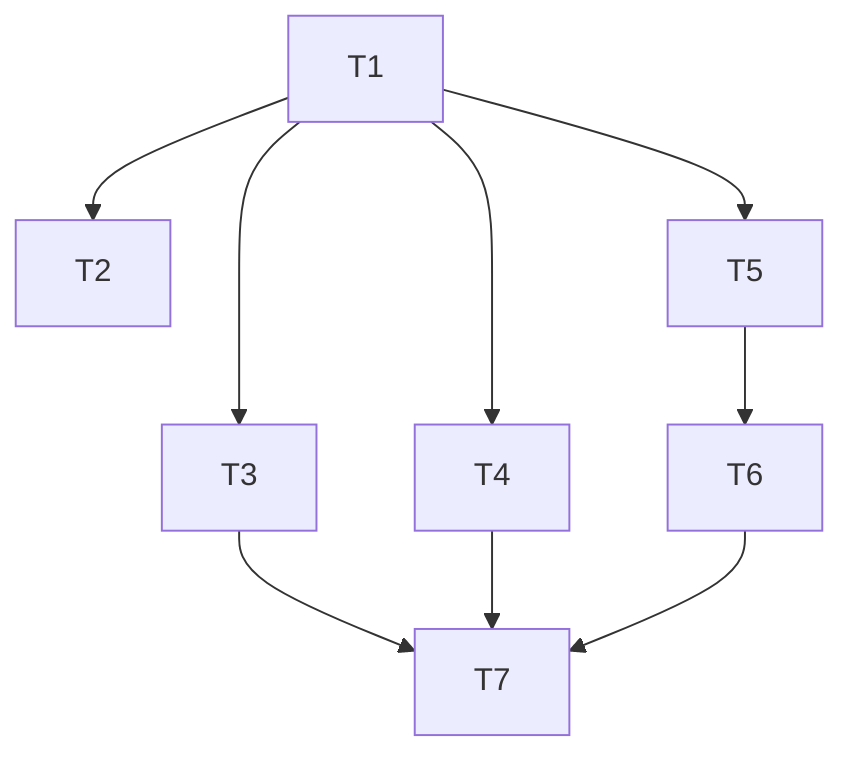

# 执行计划

## 概览
- 共 7 个 task
- 本计划交付"sidebar 多入口 + 主区整页切换"前端骨架重构：引入 react-router-dom，建立 AppShell（Sidebar + 三页 keep-mounted 主区），把 Generate / History / Characters 平提为一级页面，最后清理 HistoryDrawer / CharacterDrawer 与 `openDrawer` 抽屉互斥状态机。视觉契约与内部组件逻辑不动。

## 依赖图

## Tasks

### T1: 引入 react-router-dom + AppShell 骨架 + 路由表
- deps: []
- acceptance:
  - `frontend/package.json` 新增 `react-router-dom` v6 依赖
  - `frontend/src/App.tsx` 接入 `BrowserRouter`，渲染 `AppShell`
  - 新建 `frontend/src/components/AppShell/AppShell.tsx`：两列 grid 布局（左 sidebar + 右主区 outlet），内部常驻渲染 Generate / History 列表 / Characters 列表三个 page wrapper，根据当前 `location.pathname` 一级段用 `display: block/none` 切换可见性（非活动页同时 `aria-hidden="true"` + `inert` 或等价两件套）
  - 新建 `frontend/src/components/AppShell/PageHeader.tsx`：左侧标题槽位 + 右侧留空
  - 新建 `frontend/src/components/AppShell/Sidebar.tsx`：占位版（可仅三个 NavLink 文本）——完整样式由 T2 实现，但 `NavLink to="/generate" | "/history" | "/characters"` 必须能工作
  - 路由表覆盖 6 条：`/` → redirect `/generate`；`/generate`；`/history`；`/history/:id`；`/characters`；`/characters/new`；`*` → redirect `/generate`；`HistoryDetailPage` 非 keep-mounted（按 URL 正常 mount/unmount），其余 3 个 page 保活
  - `GeneratePage` / `HistoryPage` / `HistoryDetailPage` / `CharactersPage` 以空占位页形式存在（仅渲染 `PageHeader` 标题）以跑通路由
  - `npm run build` 通过
  - 浏览器访问 `/` 自动跳 `/generate`；访问未知路径跳 `/generate`；刷新 `/history` 停在 History 占位页而不跳回
- context_hint: 参考 DESIGN.md 的「技术栈 / 模块划分 / 接口设计（路由表 + keep-mounted 可见性 API）/ 关键流程 1 / 关键流程 2」

### T2: Sidebar 完整实现（窄态 + 三入口 + 选中态）
- deps: [T1]
- acceptance:
  - `Sidebar` 宽度在 64–80px 区间、永远窄态、无折叠/展开切换
  - 顶部小 logo / 应用名；底部留空
  - 三个一级入口自上而下：Generate / History / Characters，图标（从 `lucide-react` 或同类库选择；允许本 task 一并引入该依赖）+ 下方 label 竖向堆叠
  - 选中态：图标与文字加深 + 左侧 2px 冷蓝（accent `#1d4ed8`）竖线指示
  - 使用 `NavLink` + `aria-current="page"`
  - 视觉契约沿用（IBM Plex Sans / 浅色 / 冷色 / 现有 :root tokens），不引入新主色
  - `npm run build` 通过
- context_hint: 参考 DESIGN.md 的「模块划分 - Sidebar.tsx」「非功能性约束」「留到执行时再决定 - Sidebar 图标与宽度」与 REQUIREMENT.md 的「整体布局」

### T3: GeneratePage 包装 SubmissionWorkspace
- deps: [T1]
- acceptance:
  - `frontend/src/pages/GeneratePage.tsx` 外层套 `PageHeader title="Generate"`，内层渲染现有 `SubmissionWorkspace`
  - `SubmissionWorkspace` 及其子组件（PromptInput / ProgressPanel / VideoPlayer）**源码不修改**
  - 在 Generate 页发起生成后切到 History / Characters 页再切回 Generate，当前任务进度仍存在（借助 AppShell keep-mounted 机制）——executor 需实际在浏览器验证此行为
  - 任何位置（sidebar / page header / 其他 page）都看不到全局进度提示
  - `npm run build` 通过
- context_hint: 参考 DESIGN.md 的「模块划分 - GeneratePage.tsx」「关键流程 2」与 REQUIREMENT.md 的「Generate 页」「不做什么 - 跨页可见的生成进度」

### T4: Characters 模块平提 + grid 卡改造 + CharactersPage
- deps: [T1]
- acceptance:
  - 将原 `frontend/src/components/CharacterDrawer/` 下的 `CharacterCard` / `NewCharacterCard` / `CharacterCreateForm` 平提到 `frontend/src/components/character/`（原抽屉容器本 task 不删，留给 T7 统一清理；但平提后新页面应引用新路径）
  - `CharacterCard`：样式改造为"参考图满铺背景 + 底部渐变叠层 + Name"grid 卡；保留现有"内联展开 + 删除二次确认"交互；展开动作为原位纵向抽高（自身 `grid-row: span 2` 或等价），不打断同行其他卡、不遮盖下方
  - `NewCharacterCard`：样式为浅色背景 + `+` icon + `New Character`/`Create your own`；点击触发 `navigate('/characters/new')`，不再依赖 `openDrawer`
  - `CharacterCreateForm` 字段与提交/取消逻辑沿用；提交成功或取消后 `navigate('/characters')`
  - `frontend/src/pages/CharactersPage.tsx`：`PageHeader title="Characters"` + grid（`auto-fill minmax(280px, 1fr)` 或近似），首位永远是 `NewCharacterCard`，其后是真实角色卡（源自现有 `useCharacters` hook）；当 `pathname === '/characters/new'` 时渲染 `CharacterCreateForm` 面板（表单替换 grid / 表单在 grid 下方 / 其他"不弹 modal、不跳页"的内嵌布局皆可）
  - 空态（无角色）：grid 中仅展示占位卡即可
  - `npm run build` 通过
- context_hint: 参考 DESIGN.md 的「模块划分 - character/*」「关键流程 4」「关键流程 5」「留到执行时再决定 - /characters/new 布局」与 REQUIREMENT.md 的「Characters 页」

### T5: usePlayUrlPool hook
- deps: [T1]
- acceptance:
  - 新建 `frontend/src/hooks/usePlayUrlPool.ts`
  - 入参：`ids: string[]`；出参：`Map<id, { url?: string; status: 'idle' | 'loading' | 'ok' | 'error' }>`
  - 行为：最多并发 6 个 `GET /api/tasks/{id}/play_url`（复用现有 api client），超额排队
  - 同一 id 在 1 小时内重用已取到的 URL，不重新发请求
  - 单项失败返回 `status: 'error'`，不阻塞其他项
  - `npm run build` 通过
- context_hint: 参考 DESIGN.md 的「接口设计 - usePlayUrlPool 接口」「非功能性约束 - 性能」「关键流程 3」

### T6: HistoryCard + HistoryDetail 抽出 + HistoryPage + HistoryDetailPage
- deps: [T1, T5]
- acceptance:
  - 新建 `frontend/src/components/history/HistoryCard.tsx`：通过 `usePlayUrlPool` 拿 `play_url` → `<video preload="metadata" muted playsInline>` + `onLoadedMetadata` 后 `currentTime = 0.1` 取首帧；满铺背景 + 底部渐变叠层 + `title` + `finishedAt` 相对时间；点击 `navigate('/history/{id}')`
  - play_url 获取失败 / metadata 加载失败时背景退化为纯色浅冷灰占位，标题与时间仍显示，卡仍可点进详情
  - 将原 `HistoryDrawer` 内的 `HistoryDetail` 视觉骨架抽到 `frontend/src/components/history/HistoryDetail.tsx`（大播放器 + prompt / 元数据 / 下载）；原 `HistoryDrawer` 目录本 task 暂不删，交给 T7 统一清理
  - 新建 `frontend/src/pages/HistoryPage.tsx`：`PageHeader title="History"` + grid（`auto-fill minmax(280px, 1fr)` 或近似），数据源为现有从 IDB `history` store 读取的 hook（如 `useHistoryList`）；空态显示空态提示 + 引导去 Generate
  - 新建 `frontend/src/pages/HistoryDetailPage.tsx`：`useParams().id` 取任务；渲染 `HistoryDetail`；`PageHeader` 提供返回入口（面包屑或返回按钮，executor 现场决定）点击 `navigate('/history')`；id 不存在于 IDB 时显示"未找到该作品"文案 + 返回列表按钮，不抛异常、不跳回
  - `npm run build` 通过
- context_hint: 参考 DESIGN.md 的「模块划分 - history/*, HistoryPage, HistoryDetailPage」「错误处理 / 失败语义」「关键流程 3」「留到执行时再决定 - 返回 History 列表的交互形态」与 REQUIREMENT.md 的「History 页」

### T7: 清理 HistoryDrawer / CharacterDrawer / openDrawer + README 更新
- deps: [T3, T4, T6]
- acceptance:
  - 删除 `frontend/src/components/HistoryDrawer/` 整个目录
  - 删除 `frontend/src/components/CharacterDrawer/` 整个目录（其下子组件已在 T4/T6 中平提到新目录）
  - 主界面（原 App / 原外层容器）中的 `openDrawer: 'none' | 'history' | 'characters'` 状态与相关互斥逻辑完全移除
  - 原主界面 header 上的抽屉触发按钮移除（替代入口为 Sidebar）
  - 代码中全文搜索 `HistoryDrawer` / `CharacterDrawer` / `openDrawer` 已无残留 import 或引用
  - 更新受影响模块的 README：`frontend/src/components/README.md`（移除抽屉条目、新增 AppShell / character / history 条目）；新目录 `components/AppShell/` `components/character/` `components/history/` 以及 `pages/` `hooks/` 各建/更新 README 说明职责；同时相应更新 `.cadence/PROJECT.md` 的模块地图（删除 `hist` / `chardrawer` 节点，新增 sidebar / pages / character / history 节点，并更新模块表里 CharacterDrawer / HistoryDrawer 相关行）
  - `npm run build` 通过
  - 浏览器端完整回归：sidebar 3 入口切换 / 刷新保持当前页 / Generate 跨页保活 / History grid + 详情页 + 返回 / Characters grid + 占位卡 + 创建表单 + 原位展开 + 删除二次确认，全部符合 REQUIREMENT.md 验收清单
- context_hint: 参考 DESIGN.md 的「模块划分 - 删除」与 REQUIREMENT.md 的「去除项」「验收」清单完整 17 条
