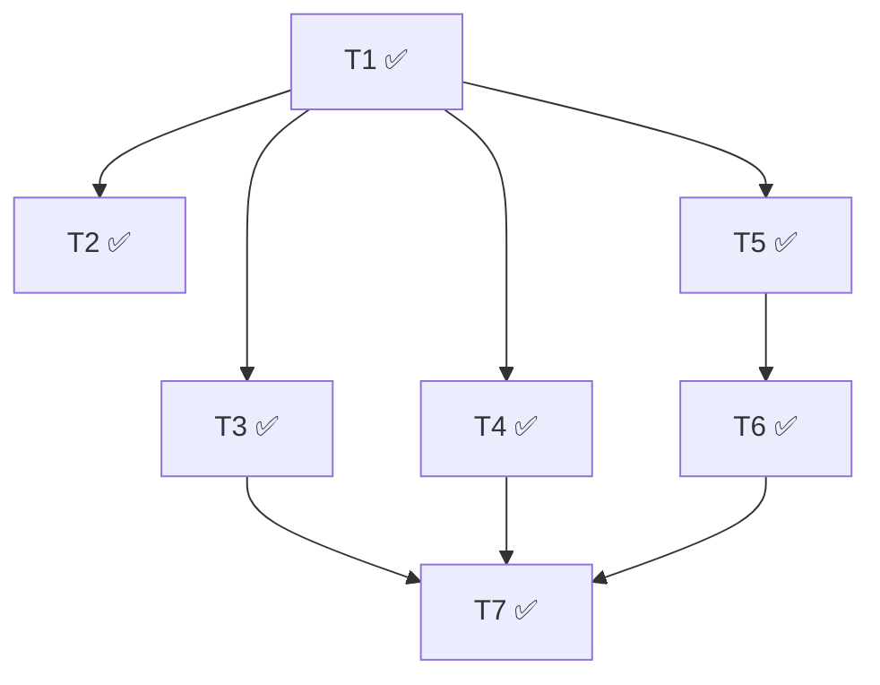

# 执行状态

## 概览
- 总数：7
- ✅ 完成：7
- ❌ 阻塞：0
- 🔄 进行中：0
- ⏳ 待启动：0
- 最后更新：2026-05-13T01:05:00Z

## 依赖图

## Tasks

### T1: 引入 react-router-dom + AppShell 骨架 + 路由表 ✅
- commit: 57afa31

### T2: Sidebar 完整实现 ✅
- commit: 4dced95

### T3: GeneratePage 包装 SubmissionWorkspace ✅
- commit: 31eac2a

### T4: Characters 模块平提 + grid 卡改造 + CharactersPage ✅
- commit: 9cf0d14

### T5: usePlayUrlPool hook ✅
- commit: b9411a8

### T6: HistoryCard + HistoryDetail 抽出 + HistoryPage + HistoryDetailPage ✅
- commit: c2c29e8

### T7: 清理抽屉 + README/PROJECT 更新 + 完整回归 ✅
- commit: 9eebef2 + fix c001f8c
