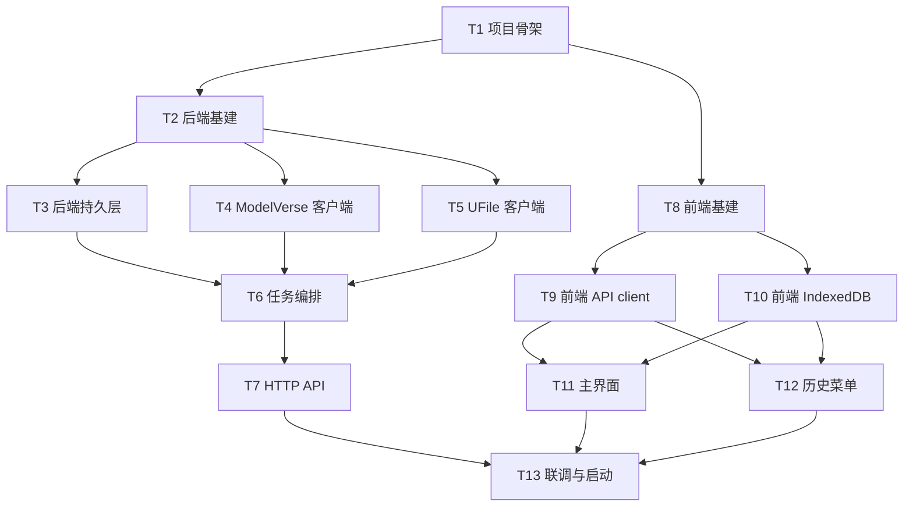

# 执行计划

## 概览
- 共 13 个 task
- 交付物：单用户网页版 AI 视频生成 MVP。前端 Vite + React 18 + TS SPA，后端 FastAPI + SQLite，外部依赖 UCloud ModelVerse `kling-v3`（生成）与 UCloud UFile（视频持久化）。支持文生视频 / 图生视频、生成中态锁定、历史菜单（播放 / 下载 / 重命名 / 删除）。

## 与 DESIGN 的有意偏离（执行期约束）
本计划中下列两点与 DESIGN 文字描述不一致，是 plan-review 阶段刻意做出的修正，executor 一律以本 PLAN 为准：

1. **历史 diff 权威源**：DESIGN「应用启动」原文写"以 IndexedDB 为准"。本 PLAN 改为**以后端 `GET /api/tasks` 为权威源**，IndexedDB 仅为本地缓存。理由：MVP 单浏览器场景下后端是唯一可写权威（rename/delete 都过后端），让前端覆盖后端会导致已删除条目残留。涉及 T10、T12。
2. **首帧图回看的实现方式**（REQUIREMENT 验收"点击历史中任意一条…能看到当时的首帧图"——DESIGN 数据模型只存 `has_image` 布尔，未指明回看路径）：本 PLAN 采用「前端 IndexedDB 同时存图片 base64 + MIME 类型」方案，不动后端 SQLite / 接口。理由：MVP 单浏览器自用，10MB 图 base64 ≈ 13MB，IndexedDB 配额充裕；后端不引入帧对象存储/帧签发接口，最小改动闭环。涉及 T10、T11、T12。

## 依赖图



## Tasks

### T1: 项目根目录结构与文档骨架
- deps: []
- acceptance:
  - 仓库根目录下存在 `backend/`、`frontend/` 两个子目录（可放占位 `.gitkeep`），以及根 `README.md`
  - 根 `README.md` 列出：项目目标、技术栈、目录结构、所需环境变量（`MODELVERSE_API_KEY`、`UFILE_PUBLIC_KEY`、`UFILE_PRIVATE_KEY`、`UFILE_BUCKET`、`UFILE_REGION`），以及前后端启动占位（具体由 T13 补齐）
  - 根目录提供 `.env.example` 模板，包含上述所有环境变量键名与示例占位值（不含真实凭据）
  - 根目录提供 `.gitignore`，至少忽略 `node_modules/`、`__pycache__/`、`*.db`、`.env`、`dist/`、`build/`、`.venv/`
- context_hint: 参考 DESIGN.md 「技术栈」「模块划分」两节确定目录边界；REQUIREMENT.md 「使用者与场景」确认是单用户本地使用

### T2: 后端基建（FastAPI 应用骨架）
- deps: [T1]
- acceptance:
  - `backend/` 下建立 Python 3.11+ 项目结构（含 `pyproject.toml` 或 `requirements.txt`，依赖至少包含 `fastapi`、`uvicorn[standard]`、`pydantic`、`pydantic-settings`、`httpx`、`ufile`、`requests`）
  - 存在可执行入口（如 `backend/app/main.py`），运行 `uvicorn app.main:app --reload` 能启动并暴露 `GET /healthz` 返回 `{"status":"ok"}`
  - 通过 `pydantic-settings` 或等价机制从环境变量 / `.env` 读取 `MODELVERSE_API_KEY`、`UFILE_PUBLIC_KEY`、`UFILE_PRIVATE_KEY`、`UFILE_BUCKET`、`UFILE_REGION`，缺失时启动报清晰错误
  - 启用 CORS（开发期允许 `http://localhost:5173`），并把请求体上限设到 ≥ 15MB（覆盖 base64 图片膨胀）
  - `backend/README.md` 写明依赖安装、启动命令、所需环境变量
- context_hint: 参考 DESIGN.md 「技术栈」「非功能性约束」

### T3: 后端持久层（SQLite tasks 表与启动孤儿清理）
- deps: [T2]
- acceptance:
  - SQLite 数据库文件路径可由配置覆盖，默认 `backend/tasks.db`
  - 应用启动时若 `tasks` 表不存在则自动建表，**字段类型严格对齐 DESIGN「数据模型 / SQLite」**：`id TEXT PRIMARY KEY`（UUID）、`modelverse_task_id TEXT NULL`、`prompt TEXT`、`has_image INTEGER`（0/1）、`status TEXT`、`error_message TEXT NULL`、`ufile_object_key TEXT NULL`、`title TEXT NULL`、`created_at INTEGER`（**unix 秒**）、`finished_at INTEGER NULL`（**unix 秒**）
  - 应用启动钩子扫描所有 `status IN ('pending','running')` 的旧行，将其 `status` 置为 `failure`、`error_message` 置为 `interrupted_by_restart`、`finished_at` 置为当前 unix 秒
  - 提供模块级仓储函数：`create_task`（插入 status=pending 行）、`get_task`、`list_success_tasks`（按 `finished_at DESC`）、`update_task_status`、`update_modelverse_id`、`update_ufile_key`、`update_task_title`、`delete_task`、`mark_orphans_failed`，连接管理使用上下文管理器
  - 后端启动日志能反映已建表 / 已清理 N 条孤儿（数量可以为 0）
- context_hint: 参考 DESIGN.md 「数据模型 / SQLite」与「关键流程 / 应用启动」

### T4: ModelVerse 客户端（submit + poll）
- deps: [T2]
- acceptance:
  - 实现 `async submit_kling_task(prompt: str, image_base64: str | None) -> str`：调用 ModelVerse `kling-v3` 提交接口（base URL `https://api.modelverse.cn`），使用 `Authorization: Bearer <MODELVERSE_API_KEY>`，**单次 HTTP 超时 30s**，返回 ModelVerse 任务 ID
  - 实现 `async query_kling_task(task_id: str) -> {status, video_url|None, error|None}`：返回归一化的内部状态（`pending` / `running` / `success` / `failure`），`success` 时附带可直接 GET 的临时视频 URL；**单次 HTTP 超时 30s**
  - 默认参数：`mode=std`、`aspect_ratio=16:9`、`duration=5`、`sound=off`；图生视频时把 `image_base64`（无 `data:` 前缀）放入 `parameters.image`
  - 调用方异常归一化：网络异常 / 5xx / ModelVerse 返回的 `Failure` 通过抛出明确的 `ModelVerseError` 表达错误信息（带可读 message），由 T6 的轮询循环统一捕获并决定是否计入失败；**不要在客户端层直接吞错并返回 status=failure**，否则上层无法区分"瞬时网络抖动"与"任务真失败"
  - 提供 `python -m backend.app.services.modelverse <prompt>` 或等价脚本入口，能在配置好环境变量时做一次真实烟雾调用（输出 task_id + 终态）
  - `backend/app/services/modelverse.py` 模块顶部 docstring 或 `backend/README.md` 段落说明端点 / 默认参数 / 错误归一化逻辑
- context_hint: 参考 DESIGN.md 「关键流程」「非功能性约束」（超时 30s）；研究文档 `research/ucloud-modelverse-kling.md`

### T5: UFile 客户端（流式上传 + 预签名 URL）
- deps: [T2]
- acceptance:
  - 实现 `upload_video_from_url(source_url: str, object_key: str) -> None`：使用 `requests.get(source_url, stream=True, timeout=300)` 拉取，再以官方 `ufile` SDK 的 `putstream` 上传到配置的 `UFILE_BUCKET`，**显式传 `Content-Type: video/mp4` header**；遇 `requests.RequestException` / UFile SDK 异常**自动重试 1 次**后才抛 `UFileError`，整体上传超时上限 300s
  - 实现 `get_play_url(object_key: str, expires_seconds: int = 3600) -> str`：返回 UFile 私有 bucket 的预签名 URL；调用 `config.set_default(expires=...)` 等 SDK 全局操作必须用模块级 `threading.Lock` 保护，避免并发 race
  - 实现 `delete_object(object_key: str) -> None`：用于 task 删除时清理 UFile 对象；对象不存在不视为错误
  - 输出 `backend/CORS.md`：写明视频播放最小 CORS 配置（AllowedMethods `GET`、`HEAD`；AllowedHeaders 至少 `Range`、`Origin`；ExposeHeaders `Content-Length`、`Content-Range`、`Accept-Ranges`），并在 `backend/README.md` 添加链接
  - 任意 UFile 调用失败均抛出 `UFileError`（自定义异常类），message 携带操作类型 + object_key + 底层错误摘要
- context_hint: 参考 DESIGN.md 「非功能性约束」（UFile 300s 超时 + 重试 1 次）；研究文档 `research/ucloud-ufile-python.md`

### T6: 任务编排服务（后台任务 + 串行锁 + 超时）
- deps: [T3, T4, T5]
- acceptance:
  - 提供模块级 in-flight 状态对象，包含 `asyncio.Lock` 与可读字段 `current_task_id: str | None`
  - 实现 `async submit_task(prompt: str, image_base64: str | None) -> {id: str, status: "pending", current_task_id: str}`：
    1. **非阻塞获取锁的正确写法**（asyncio.Lock 没有 `blocking=False` 参数）：先 `if lock.locked(): raise ConcurrentTaskError(current_task_id=<当前 in-flight 的 id>)`；否则 `await lock.acquire()`。FastAPI 单事件循环下 check-then-acquire 是安全的，因为 submit 端点本身在事件循环串行执行
    2. 抢到锁后生成 UUID，**INSERT 一行 `status='pending'`**（不是 running），设置 `current_task_id = 新 id`
    3. 通过 FastAPI `BackgroundTasks` 调度 `_run_orchestration(id, prompt, image_base64)` 并返回 `{id, status: "pending", current_task_id: 新 id}`
  - 实现 `_run_orchestration(task_id, prompt, image_base64)` 后台流程：
    1. `try` 块开始
    2. 调 T4 的 `submit_kling_task` → 成功后 `update_modelverse_id(task_id, modelverse_task_id)` + `update_task_status(task_id, 'running')`
    3. 进入轮询循环：每 10 秒调 `query_kling_task` 一次，总硬上限 300 秒；轮询循环内捕获单次 `ModelVerseError`（连续 3 次失败才计入任务失败，否则继续下一轮）
    4. 命中 `status='success'` 终态 → 取 `video_url` → 调 T5 `upload_video_from_url(video_url, f"videos/{task_id}.mp4")` → `update_ufile_key + update_task_status('success')` + 写 `finished_at`（unix 秒）
    5. 命中 `status='failure'` 终态 → `update_task_status('failure')` + `error_message`（来自 query 返回 / 异常 message） + `finished_at`
    6. 超时（300 秒）→ `update_task_status('failure')` + `error_message='timeout'` + `finished_at`
    7. 任意未捕获异常 → `update_task_status('failure')` + `error_message=str(e)` + `finished_at`
    8. `finally`：清空 `current_task_id` 并释放锁（`lock.release()`）
  - 实现 `get_play_url_for_task(task_id) -> str`：仅当 task 是 `success` 才调 T5 `get_play_url(ufile_object_key, 3600)`；否则抛 `TaskNotPlayableError`
  - 提供可运行的演示脚本或 pytest：(a) 两个并发 `submit_task` 调用中第二个抛 `ConcurrentTaskError` 且 message 包含当前 in-flight id；(b) 一次 mock 成功路径下行状态依次 `pending` → `running` → `success`，`ufile_object_key` 被填充
- context_hint: 参考 DESIGN.md 「关键流程 / 提交一个文生视频任务」（pending → running → success/failure 时序）「非功能性约束」「决策清单」

### T7: HTTP API 路由
- deps: [T6]
- acceptance:
  - 实现以下端点，请求 / 响应 JSON 字段名与类型**严格对齐 DESIGN「接口设计」**：
    - `POST /api/tasks`：请求体 `{"prompt": str (max_length=2500), "image": str | null}`（**字段名是 `image`，不是 `image_base64`**；raw base64，无 `data:` 前缀）；成功返回 `200 OK {"id": str, "status": "pending"}`；并发冲突返回 `409 Conflict {"error": "task_in_progress", "current_task_id": str}`；prompt 空 / 超长 / 图片解码失败返回 `400 Bad Request {"error": "..."}`
    - `GET /api/tasks`：返回**仅 success** 历史列表，**按 `finished_at` 倒序**；每项 `{"id": str, "prompt": str, "title": str | null, "has_image": bool, "created_at": int, "finished_at": int}`（时间为 unix 秒）
    - `GET /api/tasks/{id}`：返回单条详情 `{"id", "status", "prompt", "has_image", "title", "created_at", "finished_at", "error_message"}`；不存在返回 `404`
    - `GET /api/tasks/{id}/play_url`：仅 `status=success` 返回 `200 OK {"url": str, "expires_in": 3600}`；其它（含不存在、非 success）一律返回 `404 Not Found {"error": "..."}`
    - `PATCH /api/tasks/{id}`：请求体 `{"title": str}`，响应 `200 OK {"id": str, "title": str}`；不存在返回 `404`
    - `DELETE /api/tasks/{id}`：成功返回 `204 No Content`；若行存在且有 `ufile_object_key` 则同时调用 T5 `delete_object`；不存在返回 `404`
  - 请求体 / 响应体全部用 pydantic 模型；`prompt` 字段 `max_length=2500`
  - 错误响应统一为 `{"error": "..."}` 形态；422 由 FastAPI 默认 validation 产生，可保留默认体
  - `backend/README.md` 列出全部 6 个端点的方法、路径、请求 / 响应示例（与上述形态一致）
- context_hint: 参考 DESIGN.md 「接口设计」全部子节

### T8: 前端基建（Vite + React + TS + 视觉契约）
- deps: [T1]
- acceptance:
  - `frontend/` 下用 Vite 初始化 React 18 + TypeScript 项目，可运行 `npm run dev` 起 `http://localhost:5173`
  - 安装并配置一种样式方案（Tailwind 或 CSS Modules + 全局 tokens 均可），落地 DESIGN 「视觉契约」：明亮模式、冷色调、sans-serif、单一强调色用于主 CTA / focus / 状态指示
  - 提供全局设计 tokens（颜色、字号、间距、圆角、阴影），至少包含：背景、表面、主文本、次文本、边框、主强调色、危险色
  - `App.tsx` 默认渲染两栏布局占位：左侧历史菜单区域，右侧主工作区；可由后续 task 替换内容
  - 配置 Vite 代理：`/api` → `http://localhost:8000`（指向 T2 的后端）
  - `frontend/README.md` 写明安装、启动、构建命令；列出视觉契约要点
- context_hint: 参考 DESIGN.md 「技术栈」「视觉契约」；REQUIREMENT.md 「不做什么 / 适配与外观」（禁止打包成桌面 / 移动应用，仅浏览器）

### T9: 前端 API client + 轮询 hook
- deps: [T8]
- acceptance:
  - 实现 `src/api/client.ts`：封装对 T7 所有 6 个端点的调用；**TypeScript 类型与 T7 契约一一对齐**——POST 请求体字段是 `image: string | null`（**不是 `image_base64`**）；列表 / 详情字段是 snake_case（`has_image` / `created_at` / `finished_at`）、时间是 number（unix 秒）
  - 统一处理 4xx/5xx：把后端 `{"error":"..."}` 抛出为带 `code` 与 `message` 的自定义错误类（`ApiError`），409 时 `code='task_in_progress'` 并附 `currentTaskId`
  - 实现 `useTaskPolling(taskId, enabled)` hook：`enabled` 为真且任务非终态时每 5 秒调用 `GET /api/tasks/{id}`，命中 `success` 或 `failure` 后停止；hook 卸载时清掉定时器
  - 实现 `useSubmitTask()` hook：状态机 `idle / submitting / running / success / failure`；暴露 `submit(prompt, imageBase64?: string)` 方法（**前端在提交时不传 title**——title 通过 PATCH 设置）
  - 所有 hook / client 函数有最小说明（README 段落或代码内 doc）
- context_hint: 参考 DESIGN.md 「接口设计」「关键流程」

### T10: 前端 IndexedDB history store（含首帧图 base64）
- deps: [T8]
- acceptance:
  - 在 `src/storage/historyDb.ts` 实现 IndexedDB 封装（可用 `idb` 库），含一个 `history` object store，按 `finishedAt DESC` 索引
  - `history` value 结构**严格对齐 DESIGN「数据模型 / IndexedDB」并扩展首帧图字段**：
    ```ts
    type HistoryItem = {
      id: string
      prompt: string
      hasImage: boolean
      title?: string
      createdAt: number   // unix ms
      finishedAt: number  // unix ms
      imageBase64?: string  // 仅 hasImage=true 时存在；raw base64，无 data: 前缀
      imageMimeType?: 'image/png' | 'image/jpeg'  // 与 imageBase64 一起写入；用于 T12 渲染 data: URL
    }
    ```
  - 暴露：`putMany(items)`、`get(id)`、`getAll()` 返回按 `finishedAt DESC`、`updateTitle(id, title)`、`remove(id)`、`clear()`
  - 提供 `mergeFromBackend(backendList: ApiHistoryItem[])`，**严格按三分支处理**：
    1. **后端有 + 本地无** → 插入新行；`imageBase64` 与 `imageMimeType` 保持 `undefined`（后端不返这两个字段，本地也没有可保留的值）
    2. **后端有 + 本地有** → 更新除 `imageBase64` / `imageMimeType` 之外的字段（`title` 以后端为准），`imageBase64` / `imageMimeType` 保留本地已存值
    3. **后端无 + 本地有** → 从本地删除整条（含 `imageBase64` / `imageMimeType`）
  - 不存视频字节（仍按 DESIGN 决策走 play_url）
- context_hint: 参考 DESIGN.md 「数据模型 / IndexedDB」；本 PLAN 顶部「与 DESIGN 的有意偏离」第 2 条（首帧图 base64 存本地）

### T11: 前端主界面（输入 / 提交 / 生成中 / 错误）
- deps: [T9, T10]
- acceptance:
  - 右侧主工作区组件含：prompt textarea、可选首帧图片上传（限制 jpg/jpeg/png、≤10MB），转 base64 时**去掉 `data:image/...;base64,` 前缀**；同时把 `File.type`（`image/png` 或 `image/jpeg`）记录到组件 state，提交成功后一起写入 IndexedDB 的 `imageMimeType` 字段
  - 图片选择后展示缩略图，**提供"移除"按钮**；移除后可再次选择新图；上述行为对应 REQUIREMENT 验收第 3 条（"能在提交前移除并重新上传"）
  - 「生成视频」按钮触发 `useSubmitTask().submit(prompt, imageBase64?)`；**不向后端传 title**
  - 提交期间整个输入区与按钮置 disabled，并显示「生成中…」状态及非阻塞 spinner / 进度提示
  - 后端返回 409（code=`task_in_progress`）时给出明确提示，提示文案显示当前 in-flight 的 task id（便于用户对照），不静默吞错
  - 任务进入 `success` 终态：清空输入区，主区域显示新生成视频的内嵌 `<video controls>`（通过 `GET /api/tasks/{id}/play_url` 拉取的 URL），同时把这条新增写入 IndexedDB。**写入 IndexedDB 前必须做时间单位换算**——后端 `created_at` / `finished_at` 是 unix 秒，乘以 1000 后才能写入 T10 schema 的 `createdAt` / `finishedAt`（unix 毫秒）；若用户上传过首帧图，同步写入 `imageBase64` 与 `imageMimeType`
  - 任务进入 `failure` 终态：显示错误消息（来自后端 `error_message`），允许立即再次输入提交；失败条目**不**写入 IndexedDB
  - 严格遵守视觉契约（冷色 + 单强调色），无 dark mode 切换
- context_hint: 参考 REQUIREMENT.md 「做什么 / 输入与提交」「生成过程」「任务终态」「验收」第 3 条；DESIGN.md 「视觉契约」「关键流程」

### T12: 前端历史菜单（列表 / 播放 / 下载 / 重命名 / 删除）
- deps: [T9, T10]
- acceptance:
  - 左侧菜单展示历史列表，**按 `finishedAt` 倒序**；每条显示标题（默认是 title，没有则用 prompt 截断）、相对时间
  - 点击列表项：在右侧主工作区切换到「历史详情」视图，组件渲染：
    - prompt 全文
    - 内嵌 `<video controls>` 用 `play_url` 播放
    - 若 `hasImage=true` 且 IndexedDB 中存了 `imageBase64`，渲染首帧图：``（对应 REQUIREMENT 验收第 12 条；fallback 到 `image/png` 仅为兜底）
  - 历史详情视图提供：
    - 下载按钮：调一次 `play_url` 拿 URL，触发 `<a href={url} download>` 下载
    - 重命名：行内编辑或弹层，调 `PATCH /api/tasks/{id}` 成功后同步 `historyDb.updateTitle`
    - 删除：调 `DELETE /api/tasks/{id}` 成功后调 `historyDb.remove`；删除前用 `window.confirm` 二次确认
  - 应用启动时与每次列表写入后调 `historyDb.mergeFromBackend(backendList)`，以后端为权威
  - 当前正在生成中的任务**不出现在历史菜单**（只有 success 才落进列表，与后端 `GET /api/tasks` 一致）
- context_hint: 参考 REQUIREMENT.md 「做什么 / 历史菜单」「不做什么 / 历史菜单」（无搜索 / 筛选 / 排序切换）「验收」第 12 条；本 PLAN 顶部「与 DESIGN 的有意偏离」

### T13: 联调与启动文档
- deps: [T7, T11, T12]
- acceptance:
  - 根 `README.md` 补全端到端启动步骤：
    1. 复制 `.env.example` 为 `.env` 并填入 4 个 UFile + 1 个 ModelVerse 凭据
    2. 后端：`cd backend && pip install -r requirements.txt && uvicorn app.main:app --reload`
    3. 前端：`cd frontend && npm install && npm run dev`
    4. 打开 `http://localhost:5173` 验证健康
  - 在根目录提供一个 `scripts/dev.sh`（mac/linux）或同等启动说明，可一条命令后台跑后端、再前台跑前端
  - 「联调验证清单」（手动跑过）至少覆盖：后端 `/healthz` 通；前端能加载；提交 text-only 任务进入 running 后变 success；并发提交第二个返回 409 且 UI 显示 `task_in_progress`；成功任务出现在历史菜单且按 `finished_at desc`；图生路径上传图片后能在历史详情看到首帧图与播放视频；重命名 / 删除联动正常；刷新 / 关闭浏览器后历史依旧可见
  - 已知未在执行期解决的项（UFile 预签名 URL 最大过期、cn-bj HTTPS、ModelVerse 实际 P95 等）在根 README 末尾以「已知开放问题」列出
- context_hint: 参考 DESIGN.md 「留到执行时再决定」；REQUIREMENT.md 「验收」清单
