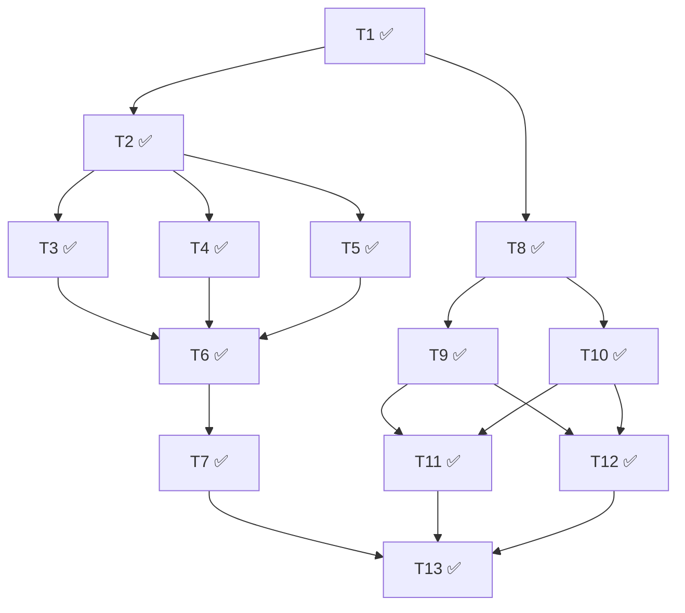

# 执行状态

## 概览
- 总数：13
- ✅ 完成：13
- ❌ 阻塞：0
- 🔄 进行中：0
- ⏳ 待启动：0
- 最后更新：2026-05-11T20:18:00Z

## 依赖图

## Tasks

### T1: 项目根目录结构与文档骨架 ✅
- commit: 9b3d89f
- 改动文件：README.md, .gitignore, .env.example, backend/.gitkeep, backend/README.md, frontend/.gitkeep, frontend/README.md
- 关键决策：.gitkeep 占位空目录；backend/frontend 各建模块 README

### T2: 后端基建（FastAPI 应用骨架） ✅
- commit: 8c15d70
- 改动文件：.gitignore, backend/README.md, backend/app/{__init__,api/__init__,services/__init__,storage/__init__,config,main}.py, backend/pyproject.toml
- 关键决策：setuptools；config 启动期校验；body limit 16 MiB 中间件；CORS 仅 5173

### T3: 后端持久层 ✅
- commit: 061c95f
- 改动文件：backend/README.md, backend/app/config.py, backend/app/main.py, backend/app/storage/README.md, backend/app/storage/db.py
- 关键决策：Settings.TASKS_DB_PATH；_connect 短连接 ctxmgr；FastAPI lifespan；update_task_status 三字段合一

### T4: ModelVerse 客户端 ✅
- commit: 5fcde89
- 改动文件：backend/app/services/modelverse.py, backend/README.md
- 关键决策：module-level async + 临时 httpx.AsyncClient；四类失败均抛 ModelVerseError；message _short(200)

### T5: UFile 客户端 ✅
- commit: ddda01c
- 改动文件：backend/app/services/ufile.py, backend/CORS.md, backend/README.md
- 关键决策：mime_type='video/mp4' 走 SDK 参数；ResponseInfo.ok()==False 也算软失败重试；threading.Lock 串行化 set_default→private_url

### T6: 任务编排服务 ✅
- commit: 05293f4
- 改动文件：backend/README.md, backend/app/services/README.md, backend/app/services/orchestrator.py, backend/pyproject.toml, backend/tests/__init__.py, backend/tests/test_orchestrator.py
- 关键决策：InFlightState dataclass + 模块级单例；submit_task 接 BackgroundTasks；finally 防御性 release

### T7: HTTP API 路由 ✅
- commit: 2f217fe
- 改动文件：backend/app/api/tasks.py, backend/app/main.py, backend/README.md
- 关键决策：base64.b64decode validate→400；DELETE UFile 失败 log warning 仍 204；TaskNotPlayableError 覆盖三种 404

### T8: 前端基建 ✅
- commit: eef886f
- 改动文件：16 个 frontend/ 下文件
- 关键决策：CSS Modules + :root tokens；React 18.3 + Vite 5；accent 冷蓝 #1d4ed8；IBM Plex Sans

### T9: 前端 API client + 轮询 hook ✅
- commit: 0ea7a00
- 改动文件：frontend/src/api/client.ts, frontend/src/api/hooks.ts, frontend/src/api/README.md
- 关键决策：字段保留后端 snake_case 不改名；ApiError 解析顺序；latestStatusRef 避免重启定时器

### T10: 前端 IndexedDB ✅
- commit: b39cb5c
- 改动文件：frontend/src/storage/historyDb.ts, frontend/src/storage/README.md, frontend/README.md, frontend/package.json, frontend/package-lock.json
- 关键决策：idb v8 + DBSchema；finishedAt index prev 游标 DESC；mergeFromBackend 单事务三分支

### T11: 前端主界面 ✅
- commit: ef67541
- 改动文件：14 个 frontend 文件（App / SubmissionWorkspace / PromptInput / ProgressPanel / VideoPlayer + CSS）
- 关键决策：SubmissionWorkspace 抽组件；image/jpg → image/jpeg 规范化；useRef 卫住 success 副作用

### T12: 前端历史菜单 ✅
- commit: e771894
- 改动文件：HistoryDrawer / HistoryDetail + CSS + App.tsx
- 关键决策：父级 selectedId 切换；refreshTick 触发 mergeFromBackend；5 秒本地 getAll 轻量轮询；行内重命名；下载每次新拉 play_url

### T13: 联调与启动文档 ✅
- commit: 001d341 + fix 0131d98
- 改动文件：.gitignore, README.md, scripts/dev.sh
- 关键决策：pip install -e "backend[dev]" 对齐 pyproject；scripts/dev.sh nohup + pid + trap；联调清单合并进根 README；.dev-backend.pid/log 加 .gitignore
- 修复：reviewer 指出 `exec npm run dev` 替换 bash 进程使 trap 失效；fix 改为 `npm run dev`（不 exec），trap 在前端退出后正常触发清理

## 最终汇总

本次 cycle 共 13 个 task：
- ✅ 完成 13 个：T1 ~ T13
- ❌ 阻塞 0 个

T13 经过 1 次 reviewer needs_fix → 1 次 fix executor 修复 → 直接 ✅，其它 12 个均一次 review pass。
